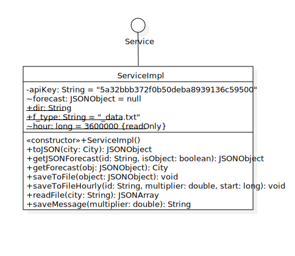
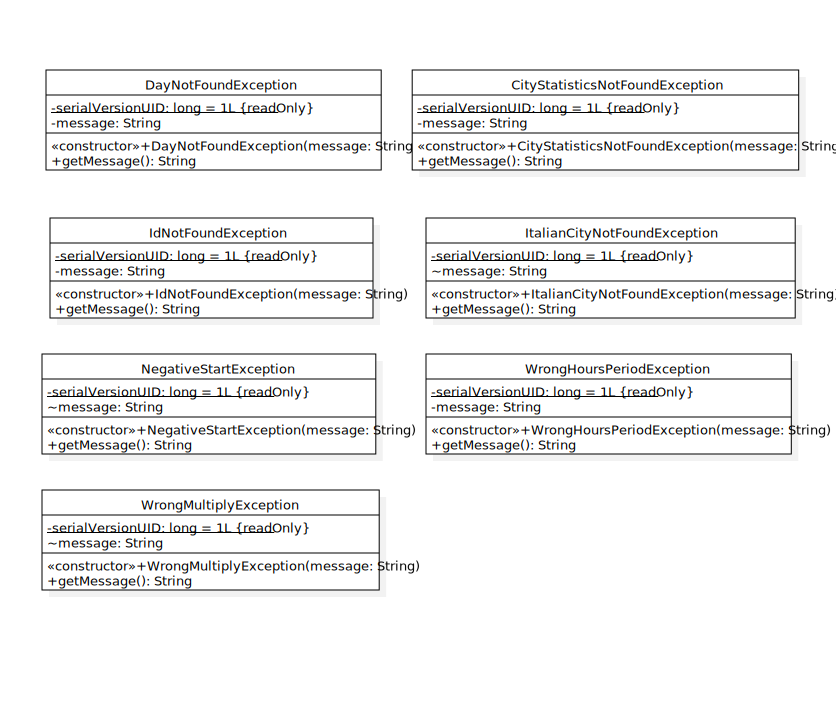

<div id="top"></div>

<!-- PROJECT SHIELDS

*** I'm using markdown "reference style" links for readability.
*** Reference links are enclosed in brackets [ ] instead of parentheses ( ).
*** See the bottom of this document for the declaration of the reference variables
*** for contributors-url, forks-url, etc. This is an optional, concise syntax you may use.
*** https://www.markdownguide.org/basic-syntax/#reference-style-links
[![LinkedIn][linkedin-shield]][linkedin-url]
[![Contributors][contributors-shield]][contributors-url]
[![Stargazers][stars-shield]][stars-url]
[![MIT Licenza][Licenza-shield]][Licenza-url]
[![Forks][forks-shield]][forks-url]
[![Issues][issues-shield]][issues-url]	
</div>


-->


<!-- PROJECT LOGO -->
<br />
<div align="center">
<a href="https://github.com/PCristian00/progetto-OOP">

</a>

<h3 align="center">PressureStats</h3>

<p align="center">
Applicazione Java che calcola statistiche di visibilità e pressione di una città data.
<br />
<a href="https://github.com/PCristian00/progetto-OOP/"><strong>Explore the docs »</strong></a>
<br />
<br />
<a href="https://github.com/PCristian00/progetto-OOP">View Demo</a>
·
<a href="https://github.com/PCristian00/progetto-OOP/issues">Report Bug</a>
·
<a href="https://github.com/PCristian00/progetto-OOP/issues">Request Feature</a>
</p>
</div>


<!-- TABLE OF CONTENTS -->
<details>
<summary>Indice</summary>
<ol>   
<li><a href="#desc">Il progetto</a></li>
<ul>
	<li><a href="#built">Costruito con</a></li>
	</ul>  
<li><a href="#uml">Diagrammi UML</a></li>
<ul>
	<li><a href="#use-case">Casi d'uso</a></li>
	</ul>
<ul>
	<li><a href="#p-controller">Package Controller</a></li>
	</ul>
<ul>
	<li><a href="#p-model">Package Model</a></li>
	</ul>
<ul>
	<li><a href="#p-service">Package Service</a></li>
	</ul>
<ul>
	<li><a href="#p-statistics">Package Statistics</a></li>
	</ul>
<ul>
	<li><a href="#p-exception">Package Exception</a></li>
	</ul>
<ul>
	<li><a href="#tests">Test</a></li>
	</ul>  
<li><a href="#prep">Preparazione</a></li>
<ul>
<li><a href="#prereq">Prerequisiti</a></li>
	<li><a href="#install">Installazione</a></li>
</ul>  
	<li><a href="#usage">Utilizzo</a></li>
	<ul><li><a href="#r">Rotte</a></li></ul>	
<li><a href="#docs">Documentazione</a></li>
<li><a href="#authors">Autori</a></li>
<li><a href="#license">Licenza</a></li>
<li><a href="#thanks">Ringraziamenti</a></li>
	</ol>
</details>

<!-- Il progetto -->
<a name="desc"></a>
## Il progetto

### PressureStats
Progetto Programmazione ad Oggetti
di [Settimi Diego](https://github.com/Diego7imi) e [Pietroniro Cristian](https://github.com/PCristian00)

PressureStats permette di salvare dati su <b>pressione</b> e <b>visibilità</b> di una città su un file di testo.

Tale salvataggio viene eseguito una sola volta oppure in automatico ogni tot ore (frequenza scelta dall'utente).

I dati raccolti possono poi essere elaborati per ricavare <b>statistiche</b> su <b>pressione</b> e <b>visibilità</b> della città:
* Pressione massima, minima, media
* Visibilità massima, minima, media
* Varianza Pressione
* Varianza Visibilità

Le <b>statistiche</b> possono quindi essere mostrate in vari <b>filtri</b>:
* <b>Giornaliere</b>: Mostra le statistiche di un intero giorno scelto dall'utente
* <b>Più giorni</b>: Mostra le statistiche per una fascia di giorno scelti dall'utente
* <b>Orarie</b>: Mostra le statistiche comprese tra due ore (di un giorno) scelte dall'utente.

<!--
Here's a blank template to get started: To avoid retyping too much info. Do a search and replace with your text editor for the following: `PCristian00`, `progetto-OOP`, `twitter_handle`, `linkedin_username`, `email`, `email_client`, `PressureStats`, `Applicazione Java che calcola statistiche di visibilità e pressione di una città data.`
-->
<p align="right">(<a href="#top">back to top</a>)</p>

<a name="built"></a>
### Costruito con

* [Spring Initializr](https://start.spring.io/)
* [Eclipse IDE](https://www.eclipse.org/)
* [Postman](https://www.postman.com/)

<p align="right">(<a href="#top">back to top</a>)</p>

<a name="uml"></a>
## Diagrammi UML

In questa sezione è possibile vedere i diagrammi UML realizzati per i vari package del programma.

Ulteriore documentazione con diagrammi UML è disponibile [qui](https://github.com/PCristian00/progetto-OOP/tree/main/UML%20Exports).


<a name="use-case"></a>
### Casi d'uso


Diagramma dei casi d'uso.
  
<p align="right">(<a href="#top">back to top</a>)</p>

<a name="p-controller"></a>
### Package Controller


Contiene il <b>Controller</b>, necessario per gestire le richieste degli utenti.
  
<p align="right">(<a href="#top">back to top</a>)</p>

<a name="p-model"></a>
### Package Model


Contiene tutta la parte di modellazione delle classi.
	
La classe <b>City</b> contiene le proprietà della città e le relative previsioni.
    
La classe <b>Forecast</b> contiene i dati di pressione, visibilità e la data della loro misurazione.
      
<p align="right">(<a href="#top">back to top</a>)</p>

<a name="p-service"></a>
### Package Service

	
  Contiene i servizi e le operazioni usate per raccogliere, salvare e mostrare i dati.
	  
  L'interfaccia Service contiene i metodi implementati da ServiceImpl e richiamati dal Controller.
	  
<p align="right">(<a href="#top">back to top</a>)</p>

<a name="p-statistics"></a>
### Package Statistics

	
Contiene le statistiche e metodi per filtrarle e presentarle.
  
<b>Statistics</b> permette di calcolare e salvare le statistiche.

<b>Filters</b> filtra le statistiche calcolate, mostrando statistiche del giorno (intero o solo alcune ore) o di più giorni.

<p align="right">(<a href="#top">back to top</a>)</p>

<a name="p-exception"></a>
### Package Exception


Contiene le eccezioni personalizzate di PressureStats.
  
<b>CityStatisticsNotFoundException</b>: Eccezione lanciata se le statistiche della città non sono state trovate.

<b>DayNotFoundException</b>: Eccezione lanciata se il giorno non è stato trovato.

<b>ItalianCityNotFoundException</b>: Eccezione lanciata se la città non è italiana.

<b>WrongHoursPeriodException</b>: Eccezione lanciata se il range orario non è corretto.

<b>WrongMultiplyException</b>: Eccezione lanciata se il moltiplicatore non è ammesso (moltiplicatore minore o uguale a 0.02).

<b>IdNotFoundException</b>: Eccezione lanciata se non è stato trovato nessun ID corrispondente alla richiesta.

<p align="right">(<a href="#top">back to top</a>)</p>

<a name="tests"></a>
### Test


L'applicazione offre la possibilità di testare la maggior parte dei metodi.
  
<b>TestController</b>: Testa le rotte del Controller.

<b>TestModel</b>: Testa i modelli City e Forecast e i loro rispettivi metodi.

<b>TestService</b>: Testa i metodi di Service.

<b>TestStatistics</b>: Testa Statistics e Filters.

<b>TestThrows</b>: Testa le eccezioni personalizzate di PressureStats.

<p align="right">(<a href="#top">back to top</a>)</p>

<a name="preparazione"></a>

<!-- Preparazione -->
<a name="prep"></a>
## Preparazione

Per iniziare ad usare l'applicazione è necessario seguire pochi semplici passi.

<a name="prereq"></a>
### Prerequisiti

Per eseguire correttamente le varie richieste, è consigliabile l'utilizzo di [Postman](https://www.postman.com/) o applicazioni simili.

<a name="install"></a>
### Installazione

1. Ottieni una API Key gratuita da [https://openweathermap.org/api](https://openweathermap.org/api)
2. Clona la repository
```sh
git clone https://github.com/PCristian00/progetto-OOP.git
```
3. Inserisci la tua API in `ServiceImpl.java`
```java
private String apiKey = "ENTER YOUR API";
```

<p align="right">(<a href="#top">back to top</a>)</p>


<!-- Utilizzo EXAMPLES -->
<a name="usage"></a>
## Utilizzo
Per eseguire correttamente le varie richieste, è consigliabile l'utilizzo di [Postman](https://www.postman.com/) o applicazioni simili.

Alcune rotte utilizzano l'[`id`](#id) della città anziché il nome.

Per trovare l'`id` della città scelta è possibile cercare la città su [OpenWeather](https://openweathermap.org/find): l'[`id`] comparirà nell'URL.

Esempio

[https://openweathermap.org/city/3169070](https://openweathermap.org/city/3169070)

Roma, id `3169070`

Ottenuto l'`id` per la città scelta, è possibile eseguire tutte le operazioni seguendo questi semplici passi.

1. Avviare il programma come applicazione SpringBoot
2. Da Postman, fare una chiamata di tipo get con la rotta scelta [(vedi tabella)](#r)
3. Consultare i dati (salvati in [`/src/main/resources/`](https://github.com/PCristian00/progetto-OOP/tree/main/pressurestats/src/main/resources))
4. Terminare il programma

Nella cartella [`/src/main/resources/`](https://github.com/PCristian00/progetto-OOP/tree/main/pressurestats/src/main/resources) sono già presenti dati meteorologici di varie città con cui è possibile testare l'applicazione. 
<p align="right">(<a href="#top">back to top</a>)</p>

<a name="r"></a>
### Rotte
Le rotte definite sono le seguenti:

N° 	| Tipo 	| Rotta 						| Descrizione
---	| --- 	| --- 							| ---
[1](#r1) | `GET` | `/current?id=6542126` 				| Restituisce e salva su un file i dati attuali di pressione e visibilità di una città data
[2](#r2) | `GET` | `/hourlySave?id=6542126&multiplier=1` 		| Finché è in esecuzione, salva ogni tot ore su un file i  dati attuali di pressione e visibilità di una città data.
[3](#r3) | `GET` | `/multiSave?multiplier=1` 				| Finché è in esecuzione, salva ogni tot ore su dei file i  dati attuali di pressione e visibilità di alcune città selezionate.
[4](#r4) | `GET` | `/oneDay?city=Rome&date=10-01-2022` 			| Restituisce le statistiche di pressione e visibilità di una città data, filtrate per il giorno scelto.
[5](#r5) | `GET` | `/moreDays?city=Rome&days=3` 				| Restituisce le statistiche di pressione e visibilità di una città data, filtrate dal giorno attuale a tot giorni passati.
[6](#r6) | `GET` | `/hourly?city=Rome&date=10-01-2022&from=9&to=12`	| Restituisce le statistiche di pressione e visibilità di una città data, filtrate per la fascia oraria scelta.

<p align="right">(<a href="#top">back to top</a>)</p>


<a name="id"></a>
### Perché viene usato ID
Le rotte [`1`](#1), [`2`](#2) e [`3`](#3) richiedono l'`id` della città per funzionare.

Nonostante sia meno pratico di usare il nome della città, usare l'`id` per richiedere i dati ad OpenWeather è la scelta migliore, in quanto l'`id` rappresenta univocamente una città.

Ciò non sempre è invece il caso per il nome: ad esempio, `Rome` si trova sia negli USA che in Italia (Roma, nome inglese).

Cercando `Roma` su OpenWeather otteniamo anche risultati da altre nazioni o anche Roma intesa come provincia.


Per questo abbiamo deciso di usare l'`id`.

<p align="right">(<a href="#top">back to top</a>)</p>

<a name="r1"></a>
### /current

```java
@GetMapping("/current")
ResponseEntity<Object> getForecast(@RequestParam(name="id",defaultValue="3169070") String id)
throws ItalianCityNotFoundException 
 ```
Se la città è italiana, restituisce su schermo la misurazione attuale di pressione e visibilità della città scelta, oltre ad alcuni dati come nazione, nome città e posizione geografica.
```txt
/current?id=6542126
```
  ```json
  {
    "id": 3169070,
    "name": "Rome",
    "country": "IT",
    "lat": 41.8947,
    "lon": 12.4839,
    "weather": [
        {
            "pressure": 999,
            "visibility": 10000,
            "dt": 1641804066,
            "date": "10-01-2022 09:41:06"
        }
    ]
}
  ```
La misurazione viene inoltre salvata su un file chiamato `CITYNAME_data.txt`

<p align="right">(<a href="#top">back to top</a>)</p>

<a name="r2"></a>
### /hourlySave

```java
@GetMapping(value = "/hourlySave")
public ResponseEntity<Object> saveToFileHourly(@RequestParam(name = "id", defaultValue = "3169070") String id,
  @RequestParam(name = "multiplier", defaultValue = "1") double multiplier)
  throws WrongMultiplyException
 ```
Se la città è italiana e il [`Multiplier`](#m) è di un valore maggiore di 0.02, restituisce su schermo un messaggio di riepilogo e la misurazione attuale di pressione e visibilità della città scelta, oltre ad alcuni dati come nazione, nome città e posizione geografica.
```txt
localhost:8080/hourlySave?id=3169070&mutliplier=1
```
  ```txt
Il salvataggio avverrà ogni ora
id=3169070, name=Rome, country=IT, lat=41.8947, lon=12.4839, weather=[pressure=999, visibility=10000, dt=1641805793, date=10-01-2022 10:09:53]
  ```
La misurazione viene inoltre salvata automaticamente con frequenza scelta dall'utente tramite il [`Multiplier`](#m) su un file chiamato `CITYNAME_data.txt`
<p align="right">(<a href="#top">back to top</a>)</p>

<a name="r3"></a>
### /multiSave

```java
@GetMapping(value = "/multiSave")
public ResponseEntity<Object> saveToFileHourly(@RequestParam(name = "multiplier", defaultValue = "1") double multiplier)
  throws ItalianCityNotFoundException, WrongMultiplyException
 ```
Se la città è italiana e il [`Multiplier`](#m) è di un valore maggiore di 0.02, restituisce su schermo un messaggio di riepilogo con la frequenza scelta.

```txt
localhost:8080/multiSave?multiplier=1
```

  ```txt
Il salvataggio avverrà ogni ora
Ricontrollare file finali, lasciare in esecuzione applicazione.
  ```
La misurazione viene inoltre salvata automaticamente con frequenza scelta dall'utente tramite il [Multiplier](#m) su 5 file diversi (uno per ogni città) chiamato `CITYNAME_data.txt`.

 Questa funzione è stata usata durante lo sviluppo per scaricare dati per più città contemporaneamente (Ancona, Milano, Napoli, Palermo, Roma).
<p align="right">(<a href="#top">back to top</a>)</p>

<a name="m"></a>
### Utilizzo del Multiplier
Per le rotte [`2`](#2) e [`3`](#3) è possibile modificare la frequenza di salvataggio attraverso la variabile <b>Multiplier</b>.

Il valore assegnato a Multiplier viene moltiplicato ad una costante Hour che contiene il valore di 1 ora espresso in millisecondi.

Sono ammessi tutti i valori superiori a `0.02` ma è consigliabile inserire un valore di almeno `0.17` (corrispondente a circa 10 minuti) in quanto OpenWeather aggiorna i propri dati con questa frequenza con un'API gratuita.

Di seguito sono riportati esempi di modifiche di frequenza:
  
Valore 		| Frequenza di salvataggio 
:---:		| :---:
  `0.02` 	| ogni minuto circa (Valore non ammesso, lancia WrongMultiplyException) 
 `0.1` 		| ogni 6 minuti 
`0.17` 		| ogni 10 minuti circa
`0.5` 		| ogni 30 minuti 
`1` 		| ogni ora (valore default) 
`1.5` 		| ogni ora e 30 minuti 
`3` 		| ogni 3 ore 
`10` 		| ogni 10 ore 

<p align="right">(<a href="#top">back to top</a>)</p>

<a name="r4"></a>
### /oneDay
```java
@GetMapping(value="/oneDay")
public ResponseEntity<Object> getStatisticsOneDay(@RequestParam(name = "city", defaultValue = "Rome") String city,
	@RequestParam(name = "date") String date)
 ```
Se esistono dati a riguardo,generati da [`1`](#1),[`2`](#2) o [`3`](#3), restituisce su schermo le statistiche di pressione e visibilità della città scelta nella data scelta.
```txt
localhost:8080/oneDay?city=Rome&date=10-01-2022
```
  ```json
  {
    "date": "10-01-2022",
    "maxMin": {
        "visibilityMin": 10000,
        "visibilityMax": 10000,
        "pressureMax": 1001,
        "pressureMin": 998
    },
    "average": {
        "visibilityAvg": 10000,
        "pressureAvg": 999
    },
    "city": "Rome",
    "variance": {
        "visibilityVariance": 0,
        "pressureVariance": 1
    }
}
  ```
La misurazione viene inoltre salvata su un file chiamato `CITYNAME_stats_DATE.txt`

<p align="right">(<a href="#top">back to top</a>)</p>

<a name="r5"></a>
### /moreDays
```java
@GetMapping(value="/moreDays")
public ResponseEntity<Object> getStatisticsMoreDays(@RequestParam(name = "city", defaultValue = "Rome") String city,
			@RequestParam(name = "days") int days)
 ```
Se esistono dati a riguardo,generati da [`1`](#1),[`2`](#2) o [`3`](#3), restituisce su schermo le statistiche di pressione e visibilità della città scelta.

Le statistiche sono calcolate dalle misurazioni giornaliere precedenti alla data attuale.

Il parametro `days` indica quante misurazioni passate devono essere comprese nella statistica.

In questo esempio, la data attuale è `10-01-2022`, quindi se il valore di `days` è `3` le misurazioni arriveranno fino al giorno `07-01-2022`.
```txt
localhost:8080/moreDays?city=Rome&days=3
```

   ```json
  {
    "date": "From 07-01-2022 to 10-01-2022",
    "maxMin": {
        "visibilityMin": 3500,
        "visibilityMax": 10000,
        "pressureMax": 1012,
        "pressureMin": 998
    },
    "average": {
        "visibilityAvg": 9741,
        "pressureAvg": 1005
    },
    "city": "Rome",
    "variance": {
        "visibilityVariance": 1294563,
        "pressureVariance": 29
    }
}
  ```
La misurazione viene inoltre salvata su un file chiamato `CITYNAME_stats_MultiDays.txt`

<p align="right">(<a href="#top">back to top</a>)</p>

<a name="r6"></a>
### /hourly
```java
@GetMapping(value = "/hourly")
public ResponseEntity<Object> getStatisticsHourly(@RequestParam(name = "city", defaultValue = "Rome") String city,
			@RequestParam(name = "date") String date, @RequestParam(name = "from") int from,
			@RequestParam(name = "to") int to) {
 ```
Se esistono dati a riguardo,generati da [`1`](#1),[`2`](#2) o [`3`](#3), restituisce su schermo le statistiche di pressione e visibilità della città scelta basate sulla fascia oraria scelta di un giorno.

```txt
localhost:8080/hourly?city=Rome&date=10-01-2022&from=9&to=12
```

  ```json
  {
    "date": "10-01-2022 from 9:00 to 12:00",
    "maxMin": {
        "visibilityMin": 10000,
        "visibilityMax": 10000,
        "pressureMax": 1000,
        "pressureMin": 999
    },
    "average": {
        "visibilityAvg": 10000,
        "pressureAvg": 999
    },
    "city": "Rome",
    "variance": {
        "visibilityVariance": 0,
        "pressureVariance": 0
    }
}
  ```
La misurazione viene inoltre salvata su un file chiamato `CITYNAME_stats_DATE.txt`
<p align="right">(<a href="#top">back to top</a>)</p>

<a name="docs"></a>
### Documentazione
Il programma è completamente documentato in Javadoc [qui](https://github.com/PCristian00/progetto-OOP/tree/main/pressurestats/doc).

Ulteriore documentazione con diagrammi UML è disponibile [qui](https://github.com/PCristian00/progetto-OOP/tree/main/UML%20Exports).
<p align="right">(<a href="#top">back to top</a>)</p>
<!-- ROADMAP -->
<!--## Roadmap
<!--
- [] Feature 1
- [] Feature 2
- [] Feature 3
- [] Nested Feature

See the [open issues](https://github.com/PCristian00/progetto-OOP/issues) for a full list of proposed features (and known issues).

<p align="right">(<a href="#top">back to top</a>)</p>


<!-- CONTRIBUTING -->
<a name="authors"></a>
## Autori

Il progetto è stato interamento realizzato da [Settimi Diego](https://github.com/Diego7imi) e [Pietroniro Cristian](https://github.com/PCristian00).

<p align="right">(<a href="#top">back to top</a>)</p>

<!--
Contributions are what make the open source community such an amazing place to learn, inspire, and create. Any contributions you make are **greatly appreciated**.

If you have a suggestion that would make this better, please fork the repo and create a pull request. You can also simply open an issue with the tag "enhancement".
Don't forget to give the project a star! Thanks again!

1. Fork the Project
2. Create your Feature Branch (`git checkout -b feature/AmazingFeature`)
3. Commit your Changes (`git commit -m 'Add some AmazingFeature'`)
4. Push to the Branch (`git push origin feature/AmazingFeature`)
5. Open a Pull Request

<p align="right">(<a href="#top">back to top</a>)</p>


<!-- Licenza -->

<a name="license"></a>
## Licenza

Distribuito con licenza MIT. Vedi [`LICENSE`](https://github.com/PCristian00/progetto-OOP/blob/main/license) per maggiori informazioni.

<p align="right">(<a href="#top">back to top</a>)</p>


<!-- CONTACT -->
<!--## Contact
<!--
Your Name - [@twitter_handle](https://twitter.com/twitter_handle) - email@email_client.com

Project Link: [https://github.com/PCristian00/progetto-OOP](https://github.com/PCristian00/progetto-OOP)

<p align="right">(<a href="#top">back to top</a>)</p>


<!-- Ringraziamenti -->

<a name="thanks"></a>
## Ringraziamenti


* [Best README Template](https://github.com/othneildrew/Best-README-Template)


<p align="right">(<a href="#top">back to top</a>)</p>


<!-- MARKDOWN LINKS & IMAGES -->
<!-- https://www.markdownguide.org/basic-syntax/#reference-style-links -->
[contributors-shield]: https://img.shields.io/github/contributors/PCristian00/progetto-OOP.svg?style=for-the-badge
[contributors-url]: https://github.com/PCristian00/progetto-OOP/graphs/contributors
[forks-shield]: https://img.shields.io/github/forks/PCristian00/progetto-OOP.svg?style=for-the-badge
[forks-url]: https://github.com/PCristian00/progetto-OOP/network/members
[stars-shield]: https://img.shields.io/github/stars/PCristian00/progetto-OOP.svg?style=for-the-badge
[stars-url]: https://github.com/PCristian00/progetto-OOP/stargazers
[issues-shield]: https://img.shields.io/github/issues/PCristian00/progetto-OOP.svg?style=for-the-badge
[issues-url]: https://github.com/PCristian00/progetto-OOP/issues
[Licenza-shield]: https://img.shields.io/github/Licenza/PCristian00/progetto-OOP.svg?style=for-the-badge
[Licenza-url]: https://github.com/PCristian00/progetto-OOP/blob/main/license
[linkedin-shield]: https://img.shields.io/badge/-LinkedIn-black.svg?style=for-the-badge&logo=linkedin&colorB=555
[linkedin-url]: https://linkedin.com/in/linkedin_username
[product-screenshot]: images/screenshot.png

