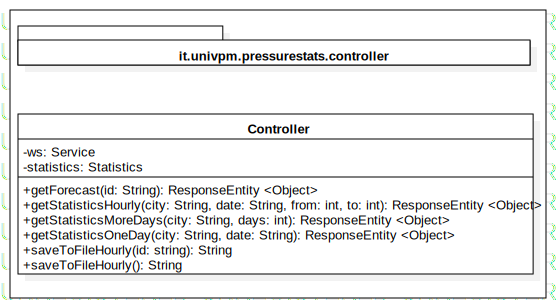

<div id="top"></div>

<!-- PROJECT SHIELDS -->
<!--
*** I'm using markdown "reference style" links for readability.
*** Reference links are enclosed in brackets [ ] instead of parentheses ( ).
*** See the bottom of this document for the declaration of the reference variables
*** for contributors-url, forks-url, etc. This is an optional, concise syntax you may use.
*** https://www.markdownguide.org/basic-syntax/#reference-style-links

[![Contributors][contributors-shield]][contributors-url]
[![Forks][forks-shield]][forks-url]
[![Stargazers][stars-shield]][stars-url]
[![Issues][issues-shield]][issues-url]
[![MIT License][license-shield]][license-url]
[![LinkedIn][linkedin-shield]][linkedin-url]

-->

<!-- PROJECT LOGO -->
<br />
<div align="center">
  <a href="https://github.com/PCristian00/progetto-OOP">
    
  </a>

<h3 align="center">PressureStats</h3>

  <p align="center">
    Applicazione Java che calcola statistiche di visibilità e pressione di una città data.
    <br />
    <a href="https://github.com/PCristian00/progetto-OOP/"><strong>Explore the docs »</strong></a>
    <br />
    <br />
    <a href="https://github.com/PCristian00/progetto-OOP">View Demo</a>
    ·
    <a href="https://github.com/PCristian00/progetto-OOP/issues">Report Bug</a>
    ·
    <a href="https://github.com/PCristian00/progetto-OOP/issues">Request Feature</a>
  </p>
</div>


<!-- TABLE OF CONTENTS -->
<details>
  <summary>Table of Contents</summary>
  <ol>    
    <li>
      <a href="#about-the-project">About The Project</a>
      <ul>
        <li><a href="#built-with">Built With</a></li>
      </ul>
      <ul>
        <li><a href="#uml">UML</a></li>
      </ul>
    </li>    
    <li>
      <a href="#getting-started">Getting Started</a>
      <ul>
       <!-- <li><a href="#prerequisites">Prerequisites</a></li>-->
        <li><a href="#installation">Installation</a></li>
      </ul>
    </li>
    <li>
      <a href="#usage">Usage</a>
      <ul>
        <li><a href="#rotte">Rotte</a></li>
      </ul>
    </li>    
    <!--<li><a href="#roadmap">Roadmap</a></li>-->
    <!-- <li><a href="#contributing">Contributing</a></li>-->
    <li><a href="#license">License</a></li>
    <!--<li><a href="#contact">Contact</a></li>-->
    <li><a href="#acknowledgments">Acknowledgments</a></li>
  </ol>
</details>


<!-- ABOUT THE PROJECT -->
## About The Project

### PressureStats
Progetto Programmazione ad Oggetti
di [Settimi Diego](https://github.com/Diego7imi) e [Pietroniro Cristian](https://github.com/PCristian00)

PressureStats permette di salvare dati su pressione e visibilità di una città su un file di testo.<p>
Tale salvataggio viene eseguito una sola volta oppure in automatico ogni ora.<p>
I dati raccolti possono poi essere elaborati per ricavare statistiche su pressione e visibilità della città:
* Pressione massima, minima, media
* Visibilità massima, minima, media
* Varianza Pressione
* Varianza Visibilità

Le statistiche possono quindi essere mostrate in vari filtri:
* Giornaliere: Mostra le statistiche di un intero giorno scelto dall'utente
* Più giorni: Mostra le statistiche per una fascia di giorno scelti dall'utente
* Orarie: Mostra le statistiche comprese tra due ore (di un giorno) scelte dall'utente.


<!--
Here's a blank template to get started: To avoid retyping too much info. Do a search and replace with your text editor for the following: `PCristian00`, `progetto-OOP`, `twitter_handle`, `linkedin_username`, `email`, `email_client`, `PressureStats`, `Applicazione Java che calcola statistiche di visibilità e pressione di una città data.`
-->
<p align="right">(<a href="#top">back to top</a>)</p>


### Built With

* [Spring Initializr](https://start.spring.io/)
* [Eclipse IDE](https://www.eclipse.org/)

<p align="right">(<a href="#top">back to top</a>)</p>


### UML



<p align="right">(<a href="#top">back to top</a>)</p>

<!-- GETTING STARTED -->
## Getting Started

<!--
This is an example of how you may give instructions on setting up your project locally.
To get a local copy up and running follow these simple example steps.
-->

<!--### Prerequisites
This is an example of how to list things you need to use the software and how to install them.
* npm
  ```sh
  npm install npm@latest -g
  ```
-->
### Installation

1. Get a free API Key at [https://openweathermap.org/api](https://openweathermap.org/api)
2. Clone the repo
   ```sh
   git clone https://github.com/PCristian00/progetto-OOP.git
   ```
3. Enter your API in `ServiceImpl.java`
   ```java
   private String apiKey = 'ENTER YOUR API';
   ```

<p align="right">(<a href="#top">back to top</a>)</p>


<!-- USAGE EXAMPLES -->
## Usage
<!--
Use this space to show useful examples of how a project can be used. Additional screenshots, code examples and demos work well in this space. You may also link to more resources.

_For more examples, please refer to the [Documentation](https://example.com)_

<p align="right">(<a href="#top">back to top</a>)</p>
-->
### Rotte
Le rotte definite sono le seguenti:

N° | Tipo | Rotta | Descrizione
----- | ------------ | -------------------- | ----------------------
[1](#1) | ` GET ` | `/current?id=6542126` | *Restituisce e salva su un file i dati attuali di pressione e visibilità di una città data*
[2](#2) | ` GET ` | `/hourlySave?id=6542126` | *Finché è in esecuzione, salva ogni ora su un file i  dati attuali di pressione e visibilità di una città data.*
[3](#3) | ` GET ` | `/oneDay?city=Ancona&?date=05-01-2022` | *Restituisce le statistiche di pressione e visibilità di una città data, filtrate per il giorno scelto.*
[4](#4) | ` GET ` | `/moreDays?city=Ancona&?days=3` | *Restituisce le statistiche di pressione e visibilità di una città data, filtrate per i giorni scelti.*
[5](#5) | ` GET ` | `/hourly?city=Ancona&?date=05-01-2022&from=10&to=13` | *Restituisce le statistiche di pressione e visibilità di una città data, filtrate per la fascia oraria scelta.*

<p align="right">(<a href="#top">back to top</a>)</p>

<!-- ROADMAP -->
<!--## Roadmap
<!--
- [] Feature 1
- [] Feature 2
- [] Feature 3
    - [] Nested Feature

See the [open issues](https://github.com/PCristian00/progetto-OOP/issues) for a full list of proposed features (and known issues).

<p align="right">(<a href="#top">back to top</a>)</p>


<!-- CONTRIBUTING -->
<!--## Contributing
<!--
Contributions are what make the open source community such an amazing place to learn, inspire, and create. Any contributions you make are **greatly appreciated**.

If you have a suggestion that would make this better, please fork the repo and create a pull request. You can also simply open an issue with the tag "enhancement".
Don't forget to give the project a star! Thanks again!

1. Fork the Project
2. Create your Feature Branch (`git checkout -b feature/AmazingFeature`)
3. Commit your Changes (`git commit -m 'Add some AmazingFeature'`)
4. Push to the Branch (`git push origin feature/AmazingFeature`)
5. Open a Pull Request

<p align="right">(<a href="#top">back to top</a>)</p>


<!-- LICENSE -->
## License

Distribuito con licenza MIT. Vedi `LICENSE.txt` per maggiori informazioni.

<p align="right">(<a href="#top">back to top</a>)</p>


<!-- CONTACT -->
<!--## Contact
<!--
Your Name - [@twitter_handle](https://twitter.com/twitter_handle) - email@email_client.com

Project Link: [https://github.com/PCristian00/progetto-OOP](https://github.com/PCristian00/progetto-OOP)

<p align="right">(<a href="#top">back to top</a>)</p>


<!-- ACKNOWLEDGMENTS -->
## Acknowledgments


* [Best README Template](https://github.com/othneildrew/Best-README-Template)


<p align="right">(<a href="#top">back to top</a>)</p>


<!-- MARKDOWN LINKS & IMAGES -->
<!-- https://www.markdownguide.org/basic-syntax/#reference-style-links -->
[contributors-shield]: https://img.shields.io/github/contributors/PCristian00/progetto-OOP.svg?style=for-the-badge
[contributors-url]: https://github.com/PCristian00/progetto-OOP/graphs/contributors
[forks-shield]: https://img.shields.io/github/forks/PCristian00/progetto-OOP.svg?style=for-the-badge
[forks-url]: https://github.com/PCristian00/progetto-OOP/network/members
[stars-shield]: https://img.shields.io/github/stars/PCristian00/progetto-OOP.svg?style=for-the-badge
[stars-url]: https://github.com/PCristian00/progetto-OOP/stargazers
[issues-shield]: https://img.shields.io/github/issues/PCristian00/progetto-OOP.svg?style=for-the-badge
[issues-url]: https://github.com/PCristian00/progetto-OOP/issues
[license-shield]: https://img.shields.io/github/license/PCristian00/progetto-OOP.svg?style=for-the-badge
[license-url]: https://github.com/PCristian00/progetto-OOP/blob/master/LICENSE.txt
[linkedin-shield]: https://img.shields.io/badge/-LinkedIn-black.svg?style=for-the-badge&logo=linkedin&colorB=555
[linkedin-url]: https://linkedin.com/in/linkedin_username
[product-screenshot]: images/screenshot.png

